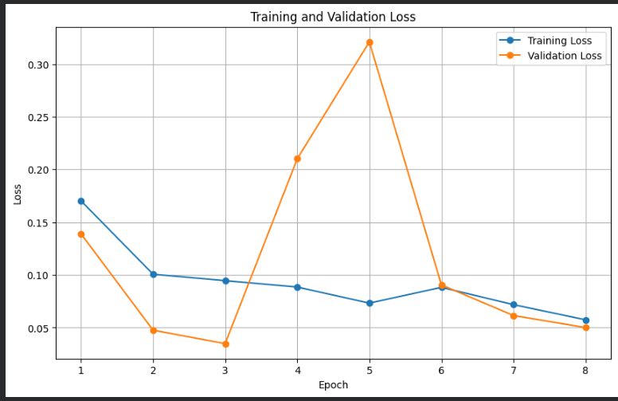
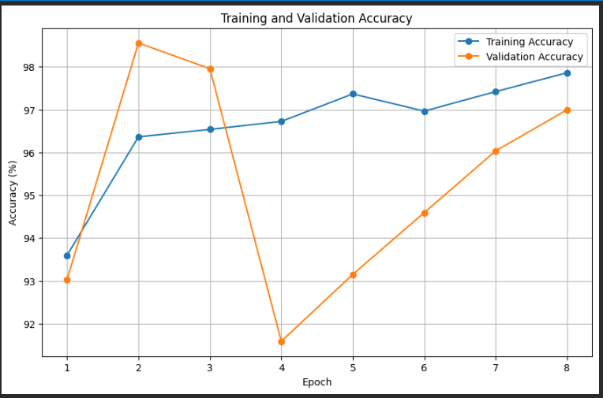
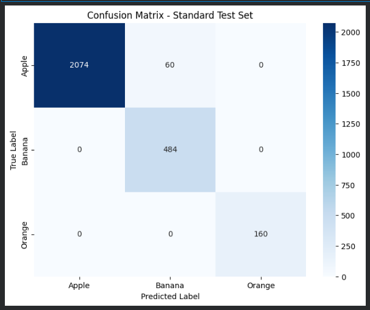
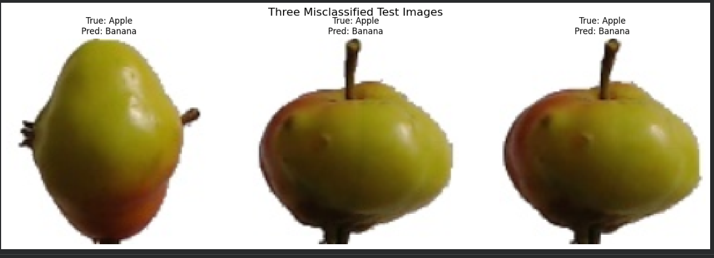
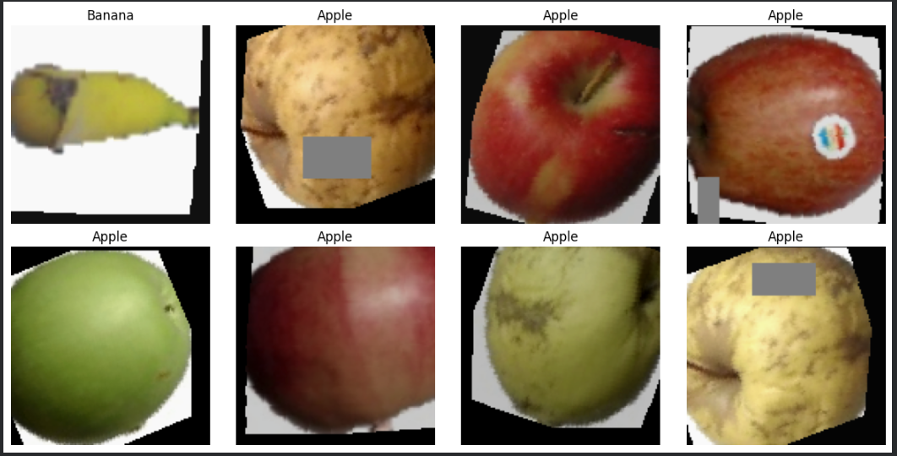
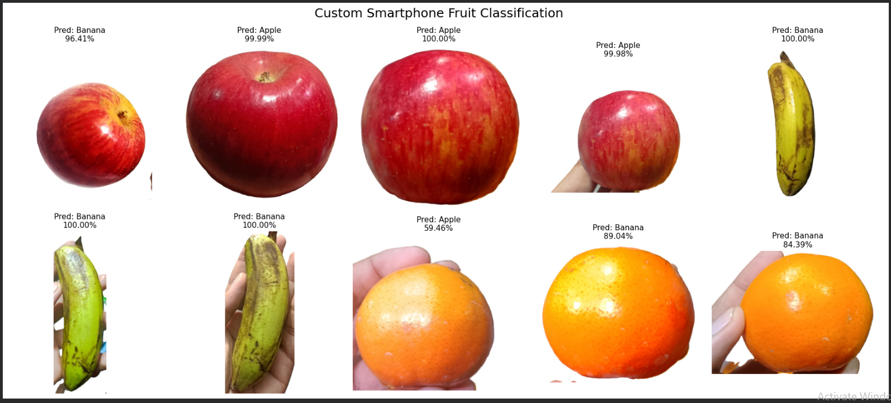

# CNN Fruit Classification — Apple / Banana / Orange

**Student ID:** 210137
**Dataset:** [Fruits-360](https://github.com/Horea94/Fruit-Images-Dataset) (Apple, Banana, Orange subset)
**Framework:** PyTorch

A convolutional neural network trained on the Fruits-360 dataset to classify
Apples, Bananas, and Oranges, then evaluated on 10 real smartphone photos of
actual fruit.

---

## Repository Structure

```
CNN-Project/
├── dataset/            # 10 custom smartphone photos (raw, as taken)
├── model/
│   └── 210137.pth      # Trained model state dict
├── 210137.ipynb         # Full Colab notebook (Run All reproduces everything)
├── results/             # Plots shown below
└── README.md
```

---

## Model Architecture

A CNN built from scratch (`class CNN(nn.Module)`), no pretrained backbone.

| Block | Layers | Output |
|---|---|---|
| Block 1 | Conv2d(3→32, 3×3) → BatchNorm2d → ReLU → MaxPool2d(2) | 32 channels, /2 |
| Block 2 | Conv2d(32→64, 3×3) → BatchNorm2d → ReLU → MaxPool2d(2) | 64 channels, /4 |
| Block 3 | Conv2d(64→128, 3×3) → BatchNorm2d → ReLU → MaxPool2d(2) | 128 channels, /8 |
| Block 4 | Conv2d(128→128, 3×3) → BatchNorm2d → ReLU | 128 channels |
| Pooling | AdaptiveAvgPool2d((4,4)) | 128×4×4, fixed size regardless of input resolution |
| Classifier | Flatten → Linear(2048→256) → ReLU → Dropout(0.5) → Linear(256→3) | 3 class logits |

**Design choices:**
- **BatchNorm** after every convolution stabilizes and speeds up training.
- **AdaptiveAvgPool2d** before the classifier makes the network robust to
  input size and keeps the fully-connected head small (reduces overfitting)
  compared to flattening the full feature map.
- **Dropout(0.5)** in the classifier head is the main regularizer against
  overfitting to Fruits-360's very clean, low-variance images.

**Training configuration:**
- Loss: `CrossEntropyLoss`
- Optimizer: `Adam` (lr=0.001, weight_decay=1e-4)
- LR Scheduler: `ReduceLROnPlateau` (halves LR after plateaus in validation loss)
- Batch size: 64
- Early stopping on validation accuracy
- Data augmentation (training only): `RandomResizedCrop`, `RandomHorizontalFlip`,
  `RandomRotation`, `RandomAffine`, `ColorJitter`, `RandomErasing` — needed
  because Fruits-360 images are studio photos on a pure white background;
  without heavy augmentation the model overfits to that narrow distribution
  and generalizes poorly to real photos.
- Custom photo pipeline: background removed (`rembg`) and re-composited on a
  white canvas before prediction, so smartphone photos match the training
  distribution. Predictions also use Test-Time Augmentation (original +
  horizontal-flip, averaged).

---

## Training Results

Training ran for 8 epochs (early stopping triggered — validation accuracy
peaked early and further epochs did not sustainably improve it).

### Loss Curve


### Accuracy Curve


Best validation accuracy: **~98.5%** (epoch 2) — that checkpoint is what's
saved to `model/210137.pth`. Validation loss/accuracy is noisy between
epochs 2–5 (a loss spike around epoch 4–5), which is expected with a small
validation split combined with strong augmentation; it stabilizes and
converges again by epoch 8, tracking the training curve closely.

---

## Standard Test Set Performance

**Overall test accuracy: 97.84%** (2,718 / 2,778 correct)

### Confusion Matrix


| Class | Precision | Recall | Support |
|---|---|---|---|
| Apple | 100.0% | 97.19% | 2,134 |
| Banana | 88.97% | 100.0% | 484 |
| Orange | 100.0% | 100.0% | 160 |

All 60 test-set errors are Apples misclassified as Banana (Apple's recall
loss = Banana's precision loss). Orange has perfect precision and recall on
the standard test set.

### Error Analysis


The three misclassified examples are all pale yellow/green apple varieties
with a prominent stem — visually closer to a banana's color and elongated
stem shape than a typical red apple, which explains why the model confuses
them specifically with Banana rather than Orange.

### Sample Augmented Training Data


Shows the training-time augmentation in effect: random crop/rotation, color
jitter, and `RandomErasing` (visible as the gray occlusion patches) — this is
what forces the model to learn shape/texture features instead of memorizing
exact pixel layouts.

---

## Real-World (Smartphone Photo) Predictions



| Photo | True Class | Predicted | Confidence | Correct? |
|---|---|---|---|---|
| 1 | Apple | Banana | 96.41% | ✗ |
| 2 | Apple | Apple | 99.99% | ✓ |
| 3 | Apple | Apple | 100.00% | ✓ |
| 4 | Apple | Apple | 99.98% | ✓ |
| 5 | Banana | Banana | 100.00% | ✓ |
| 6 | Banana | Banana | 100.00% | ✓ |
| 7 | Banana | Banana | 100.00% | ✓ |
| 8 | Orange | Apple | 59.46% | ✗ |
| 9 | Orange | Banana | 89.04% | ✗ |
| 10 | Orange | Banana | 84.39% | ✗ |

**Custom photo accuracy: 6 / 10 (60%)**

Bananas and (most) apples transfer well from Fruits-360 to real photos —
those classes have distinctive, hard-to-confuse silhouettes. **Every orange
was misclassified**, and one apple was misclassified as banana. Two likely
causes:
1. **Color/lighting mismatch:** Fruits-360's oranges are matte and evenly
   lit; phone-camera oranges have strong specular highlights from indoor
   lighting, which can shift the dominant color the CNN keys on.
2. **Residual domain gap after background removal:** removing the
   background fixes the *background* mismatch, but not lighting, glare, or
   the slight framing differences (hand holding the fruit changes the visible
   silhouette vs. Fruits-360's free-floating fruit shots).

This is a realistic and honest result to report — it shows the model
generalizes well within the training distribution (97.84% test accuracy) but
still has a visible sim-to-real gap on some classes, which is exactly the
kind of finding this assignment is designed to surface.

---

## How to Reproduce

1. Open `210137.ipynb` in Google Colab.
2. Click **Runtime → Run All**.
3. The notebook automatically:
   - Clones this repo (custom photos + any existing `model/210137.pth`)
   - Downloads Fruits-360 and builds the Apple/Banana/Orange subset
   - Trains the CNN from scratch **if no saved model is found**, otherwise
     loads the existing `210137.pth` and skips straight to evaluation
   - Removes the background from the 10 custom photos and runs prediction
   - Regenerates every plot in `results/`
